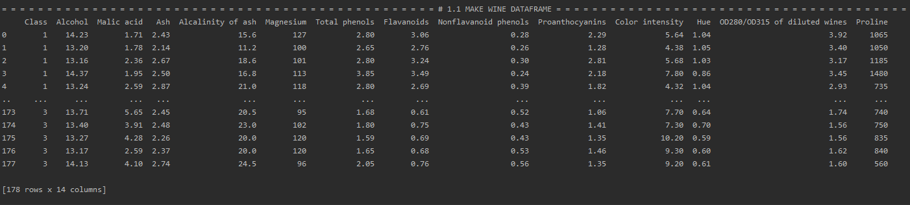

# R+Python 컴퓨팅: Homework 2

## 목차
1. [와인 클래스에 대한 kNN 알고리즘 적용]()  
1.1. [문제 개요]()  
1.2. [분석 진행]()

## 1. 와인 클래스에 대한 kNN 알고리즘 적용
### 1.1. 문제 개요
[wine_data.csv](https://github.com/94wogus/R_python_homework2/blob/master/wine_data.csv)
에는 3 가지 종류의 와인에서 발견 된 다른 성분들에 대해 13 가지의 특성을 기록이 되어 있습니다.
이것을 활용하여 분석을 진행하려 합니다.

분석 과정에서 출력 내용을 조금 보기 쉽게 하기 위하여 다음과 같은 함수를 지정하였습니다.
```python
import math
def section(str, start=False):
    l = (120 - len(str)) / 2
    if not start:
        print('\n')
    print("= "*math.ceil(l) + str.upper() + " ="*math.floor(l))
```
...  
...  
...  
### 1.2. 분석 진행
#### 1.2.1. Make Wine Dataframe
Pandas를 사용해 wine_data.csv파일을 wine 데이터프레임을 만듭니다.
```python
from pandas import read_csv
csv_path = './wine_data.csv'
wine_df = read_csv(csv_path)

print(wine_df)
```
...  
...

다음과 같은 결과가 나옵니다.


#### 1.2.2. Make Wine Dataframe
Pandas를 사용해 wine_data.csv파일을 wine 데이터프레임을 만듭니다.
```python
from pandas import read_csv
csv_path = './wine_data.csv'
wine_df = read_csv(csv_path)
```