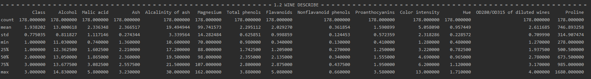

# R+Python 컴퓨팅: Homework 2

## 목차
1. [와인 클래스에 대한 kNN 알고리즘 적용]()  
1.1. [문제 개요]()  
1.2. [분석 진행]()

## 1. 와인 클래스에 대한 kNN 알고리즘 적용
### 1.1. 문제 개요
[wine_data.csv](https://github.com/94wogus/R_python_homework2/blob/master/wine_data.csv)
에는 3 가지 종류의 와인에서 발견 된 다른 성분들에 대해 13 가지의 특성을 기록이 되어 있습니다.
이것을 활용하여 분석을 진행하려 합니다.

분석 과정에서 출력 내용을 조금 보기 쉽게 하기 위하여 다음과 같은 함수를 지정하였습니다.
```python
import math
def section(str, start=False):
    l = (120 - len(str)) / 2
    if not start:
        print('\n')
    print("= "*math.ceil(l) + str.upper() + " ="*math.floor(l))
```
...  
...  
...  
### 1.2. 분석 진행
#### 1.2.1. Make Wine Dataframe
Pandas를 사용해 wine_data.csv파일을 wine 데이터프레임을 만듭니다.
```python
from pandas import read_csv
csv_path = './wine_data.csv'
wine_df = read_csv(csv_path)

print(wine_df)
```
...  
...  
...  
다음과 같은 결과가 나옵니다.


asdsa
#### 1.2.2. Wine Dataframe Describe
Wine Dataframe에서 describe 메소드를 사용하여 요약통계량을 구합니다.
```python
print(wine_df.describe())
```

asdsa

#### 1.2.3. train test set 만들기
```python
# pop을 활용하여 DataFrame에서 Class Column을 지움과 동시에 y 변수에 할당합니다.
from sklearn.model_selection import train_test_split
y = wine_df.pop('Class')

# train test set를 0.3의 비율로 분리합니다.
# 또한 데이터의 비율을 y의 비율과 일치 시키기 위해 stratify를 설정합니다.
X_train, X_test, y_train, y_test = train_test_split(wine_df, y, test_size=0.3, stratify=y)
```

asdsa
#### 1.2.4. Train KNN model(neighbors=5)
Scikit-learn의 KNeighborsClassifier를 사용하여 70%인 X_train과 y_train을 바탕으로 모형을 트레이닝 시킵니다.
n_neighbors은 5로 설정 하였습니다.
```python
from sklearn.neighbors import KNeighborsClassifier
n_neighbors = 5
print("n_neighbors: {}".format(n_neighbors))
wine_knn_5 = KNeighborsClassifier(n_neighbors=n_neighbors, p=2, metric='minkowski')
wine_knn_5.fit(X_train, y_train)

# Model에 대하여 Train Set의 예측값을 출력 합니다.
train_score = wine_knn_5.score(X_train, y_train)
print("Score_with_train_set: {}%".format(round(train_score*100, 2)))
print(wine_knn_5.score(X_train, y_train))

# Model에 대하여 Test Set의 예측값을 출력 합니다.
test_score = wine_knn_5.score(X_test, y_test)
print("Score_with_test_set: {}%".format(round(test_score*100, 2)))
print(wine_knn_5.score(X_test, y_test))
```
```text
n_neighbors: 5
Score_with_train_set: 80.65%
0.8064516129032258
Score_with_test_set: 68.52%
0.6851851851851852
```


